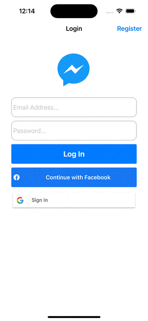
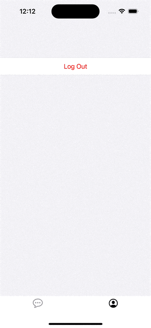

# Authenticate using Firebase to login with FirebaseAuth, Facebook and Google

## Register using FirebaseAuth

## Login with a registered account

## Login with facebook

## Login with google

## Log out

## Quick start
1. Clone and run 'pod install' in the terminal.
2. Open the Messenger.xcworkspace
3. Add a new project and an Apple app in Firebase console.
4. Download your own GoogleService-Info.plist and drag it into the Messenger root folder.

Build the project in Xcode.

## Reference

[Introducing Firebase Authentication](https://www.youtube.com/watch?v=8sGY55yxicA)

[Firebase Authentication Docs](https://firebase.google.com/docs/auth)

[google-signin](https://firebase.google.com/docs/auth/ios/google-signin)

[facebook-login](https://developers.facebook.com/docs/facebook-login/ios)
